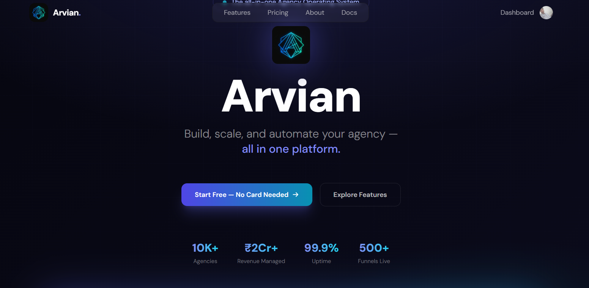
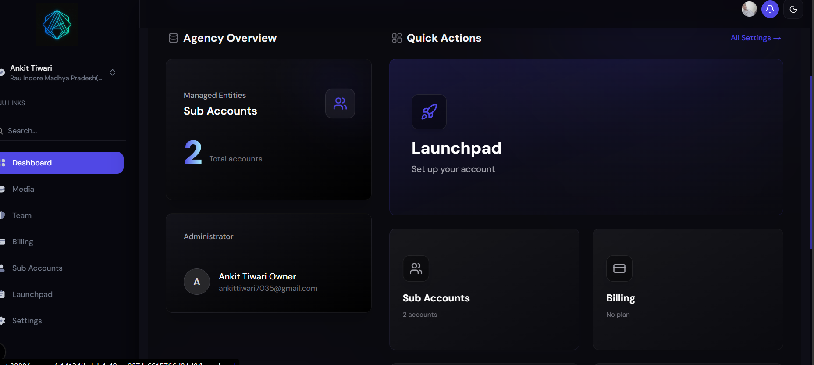
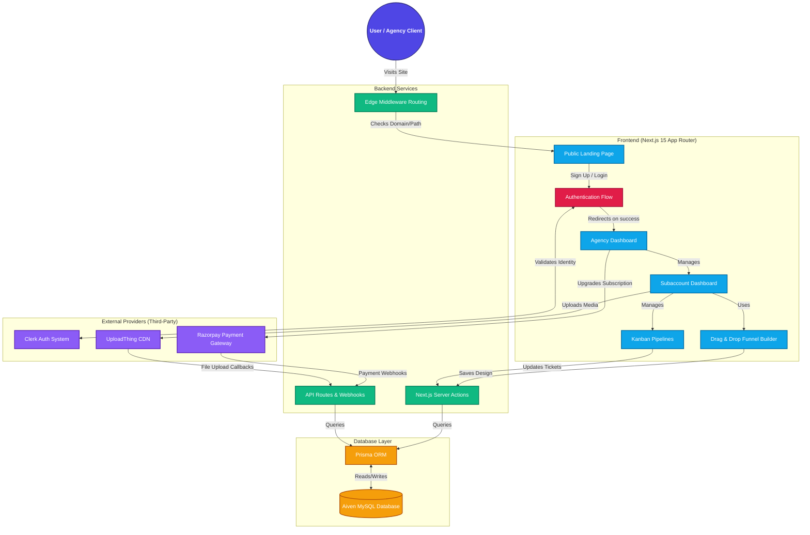

<div align="center">
  
  
  
  
  
</div>

<h1 align="center">Arvion - B2B SaaS Website & Funnel Builder</h1>

<p align="center">
  
</p>
<p align="center">
  
</p>

<p align="center">
  A complete, multi-tenant B2B SaaS platform allowing agencies to manage their clients (subaccounts), build highly-customizable sales funnels, manage complex pipelines, and process payments entirely under a white-label brand.
</p>

---

## 🚀 Project Overview

**Arvion** is a comprehensive SaaS solution acting as a website and marketing funnel builder for Agencies. The project is modeled exactly after professional B2B white-labeling tools.

Agencies can:
* Create unlimited customized **Subaccounts** for their business clients.
* Assign custom user permissions and invite team members.
* Build advanced **Funnels** with a drag-and-drop website editor.
* Map custom domains or subdomains to specific funnels dynamically.
* Manage fully functional **Pipelines** with Kanban-style drag-and-drop tickets.
* Monitor analytics through dashboards.
* Accept payments using an integrated **Razorpay** billing portal.

---

## ⚡ Application Circuit Diagram (Architecture Flow)

Below is the complete data flow and system architecture diagram mapping out how the user interacts with the Next.js frontend, Server Actions, Database, and external APIs (Clerk, Razorpay, UploadThing).



---

## 🛠️ Technology Stack

| Layer | Technology Used |
| :--- | :--- |
| **Frontend Framework** | Next.js (v15), React (v18) |
| **Styling & UI Components** | Tailwind CSS, Shadcn UI, Tremor, Lucide React, Pangea DnD |
| **Backend & APIs**  | Next.js Server Components, Server Actions, Edge Middleware |
| **Database & ORM** | Aiven MySQL Database, Prisma ORM |
| **Authentication**   | Clerk Authentication |
| **File Storage**   | UploadThing |
| **Payment Gateway**  | Razorpay |
| **Forms & Validation** | React Hook Form, Zod schemas |

---

## 📂 Key Features & Folder Structure

* `src/app/site`: **Public Landing Page** explaining the platform benefits and SaaS pricing cards.
* `src/app/(main)/agency`: **Agency Dashboard** - Central hub for agency owners to manage subaccounts, configure team members, handle global billing, and review total pipeline revenue.
* `src/app/(main)/subaccount`: **Client Interface** - The core workspace for a subaccount instance containing drag-and-drop Kanban pipelines, contact management, media storage, and automations setup.
* `src/app/[domain]`: **Multi-Tenant Routing Engine** - Next.js dynamic routes allowing unlimited custom funnel websites built via the platform to be hosted on dedicated subdomains seamlessly.
* `src/components/forms`: **Robust Form Interactions** - Pre-built forms using Zod schema validation for user invites, pipeline lane management, and agency configuration.
* `src/lib/razorpay`: **Integrated Payment Webhooks** - Endpoints securely capturing Razorpay updates to synchronize SaaS subscription active status instantly with the database.

---

## ⚙️ How It Works Under The Hood

1. **Standard Server Action Data Modification (e.g., Editing Pipeline Lane):**
   - The React application passes validated form data via `React Hook Form` / `Zod` to a Next.js Server Action (`upsertLane`).
   - The Next.js backend receives the typed payload, and performs an authentication check via Clerk.
   - A secure database query is executed via `Prisma` against the MySQL database.
   - Once saved, the server action automatically calls `revalidatePath` to clear the Next.js router cache, directly updating the UI without making separate REST API requests.

2. **Custom Domain Multi-Tenant Routing (e.g., Viewing a Funnel):**
   - A user goes to `client.your-agency.com`.
   - Next.js `middleware.ts` intercepts the request, reads the host header to identify the subdomain (`client`).
   - The middleware dynamically rewrites the incoming path to `src/app/[domain]/[path]/page.tsx`.
   - The `[domain]` server component securely queries the database via Prisma to render the exact custom Funnel page constructed for that particular domain.

---

## 🏁 Getting Started (Local Development)

Follow these instructions to get a copy of the project up and running on your local machine.

### Prerequisites:
* **Node.js** (v18+)
* **MySQL Database** (Local or hosted via Aiven / AWS RDS)
* **Clerk Account** (For Authentication Keys)
* **UploadThing Account** (For File Storage Keys)
* **Razorpay Account** (Optional, for payment sandbox mode)

### Installation Steps:

1. **Clone the repository:**
   ```bash
   git clone https://github.com/your-username/saas-arvion.git
   cd saas-arvion
   ```

2. **Install dependencies:**
   ```bash
   npm install
   ```

3. **Initialize Environment Variables:**
   Create a `.env` file in the root directory and populate it with the necessary keys. Reference `.env.example` if available.

4. **Initialize the Database:**
   ```bash
   npx prisma generate
   npx prisma db push
   ```

5. **Start the development server:**
   ```bash
   npm run dev
   ```

The application will be running on `http://localhost:3000`.

---

<p align="center">
  Developed and managed for <b>Arvion</b>.
  Here is a live demo <b>https://arvian-saas-platform.vercel.app/</b> 
</p>  
<p>Devloped by Ankit</p>
 
